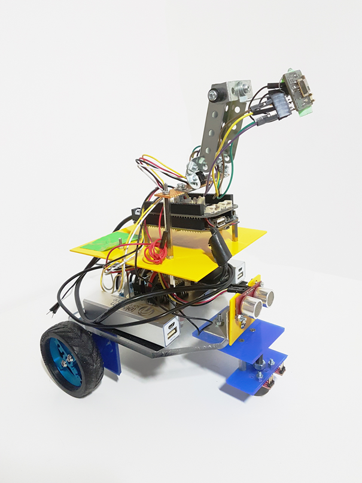

# Le robot à guidage thermique

## Vidéo

### Télécharger la présentation : [PDF](assets/presentation.pdf)

## Description
Ce projet consiste à réaliser un OS Linux embarqué et un programme en C permettant à un robot de suivre un humain.
Le suivi s'effectuera grâce à un capteur thermique 8x8. Le robot doit suivre l'humain en détectant sa chaleur et sans heurter d'obstacle.

## Liste des choses à faire:
  - [x] Machine virtuelle avec Buildroot et boot NFS
  - [x] Liaison UART entre la carte beagle Bone et la carte Teensy
  - [x] Acquérir une image de la matrice thermique et l'afficher
  - [x] Déterminer la position de l'objet le plus chaud sur une image.
  - [x] Le robot peut suivre une personne
  - [x] Le robot ne s'approche pas à plus de 15 cm
  - [x] Le robot ne percute pas d'obstacle
  - [x] Le robot utilise plusieurs capteurs pour un meilleur suivi
  - [x] Documentation
  
  ## Matériel
   * Une carte BeagleBone Black
   * Un robot motorisé avec sa carte d'interface moteurs (Teensy 3.1)
   * Un capteur infrarouge Grid-Eye Panasonic
   * Un capteur à ultrasons SRF08
  
  ## Contraintes
  Le développement doit être réalisé en langage C sur une machine virtuelle Linux Debian
  
## Documentation
La documentation de ce projet est disponible [ici](documentation/README.md).
Elle contient l'ensemble des étapes permettant de recréer l'OS Linux ainsi que les explications du programme en C.

## Copyright
Ce projet a été réalisé par des étudiants de Télécom St-Etienne dans le cadre de leurs études.
